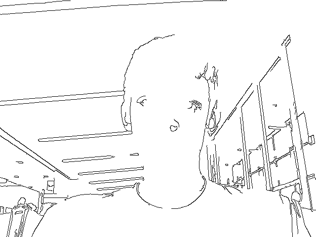
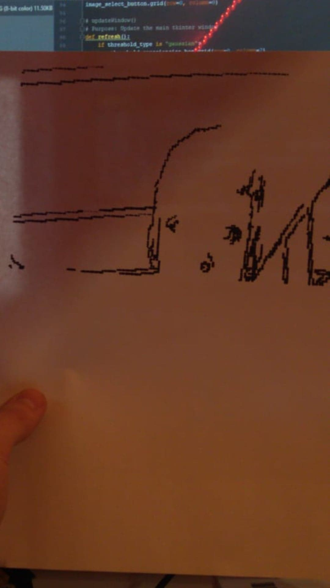
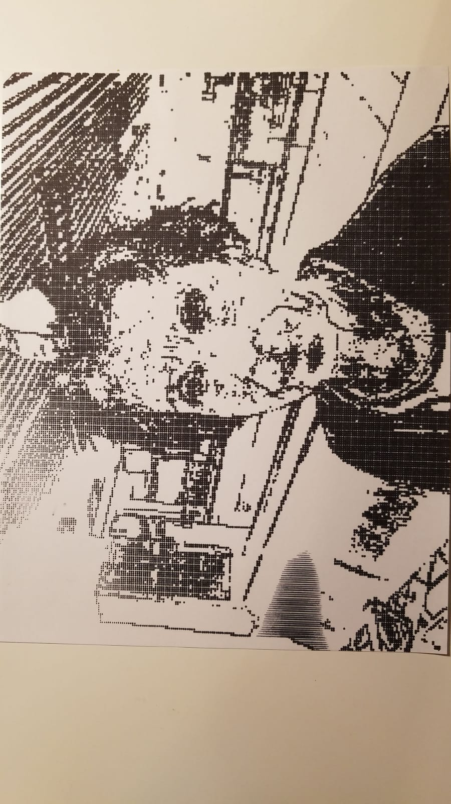

# Face Draw
Draw your face, or something else.

## Abstract
A python program that will convert an image to a G-code file that you can run on a 3D printer. By attaching a marker or other drawing utensil
your 3d printer head you can draw an image.

## Warning
Running G-code that you do not understand has the potential to crash your machine. Please make sure you properly understand what this code does before running it.
Also please know how 3D printers work before running this code.

## But How?
The intention of this program is to allow you to draw your face, or anything else, with a 3D printer or similar hardware. Simply strap a pen or marker
to your machine tool head and a piece of paper to your print surface and run the generated g-code file.

On the software side this project relies heavily on OpenCV for image processing as well as a bit of slicer code to generate a G-code file.
Eventually, there will be multiple different types of slicers for different types of images, but now there is just **Raster**.

**Raster** will divide your image into different squares and determine if each square needs to be colored in based on the number
of black pixels in it.

Initial:

Processed:

Final Result:

## Work in Progress
Right now the raster function works! Create your own raster of an image by following the instructions below!
[Let me know](https://github.com/flipthedog/FaceDraw/issues) if you find any bugs or issues! And feel free to submit a [pull
request](https://github.com/flipthedog/FaceDraw/pulls)!

## Instructions
Right now just Rastering works, do the following:
1. Open create_raster_gcode.py
2. Edit the necessary settings found within the file
    a. Uncomment to take a picture
    b. Change the filename
    c. Change bed size
    d. Change feedrate
    e. (Optional) Change z_hop
    f. (Optional) Change z_tune
3. Execute the program
4. Look in the GCode folder for your .gcode file with the name filename

### Required Modules
1. Python version 3.x
2. [python-opencv](https://github.com/skvark/opencv-python) --  `pip install opencv-python`
3. Some other default python modules

### Raster
1. Open `create_raster_gcode.py`
2. Change the `filename` field to your preferred filename
3. Change the printer configuration fields to your printer

# Supported Firmware
Right now this program will only support the **RepRap firmware** flavor. However, that list will grow soon.

# Resources
1. Use [NCViewer](https://ncviewer.com/) to visualize your generated G-code file!
